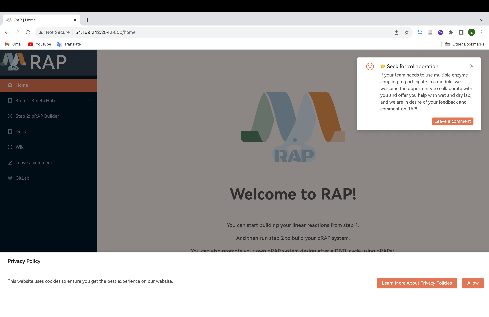

---
hide:
  - navigation
---
# Build your pRAP system with RAP
## Get started
!!! success "v0.1.0-beta"

    RAP is now available at [http://54.169.242.254:5000](http://54.169.242.254:5000)!

If you go to the `Home` page, you will see the following interface:

## Step 1: Run KineticHub

The first step involves two tasks, i.e., searching target reaction and enzyme record for the reaction and constructing a linear reaction, optimal ratio of enzymes based on the data will  be returned after these two tasks.

### Search target reaction and enzyme record for the reaction

First, in the `KineticHub > Search Enzyme` page, enter the query and the type of keyword you want to retrieve, as shown in the following figure:

Here are some examples of query and the corresponding keyword types:

|      query      | keword type |
| :-------------: | :---------: |
|    1.1.1.101    |  EC number  |
| Nadh peroxidase |    Name     |
|    Oxidation    |    Type     |
|     alcohol     |  Substrate  |
|      NADPH      |   Product   |

In order to search for the target enzyme more accurately, it is most recommended to use EC number to search for the enzyme.

After typing in the query as well as selecting the keyword type and clicking `search`, you will see this interface:

You can find the reaction you are interested in from the search results and browse its basic information, corresponding to the target reaction, you can click on the `Get Kcat` to view more.

After clicking `Get Kcat`, the interface will look like this:

Here you can get the species from which the enzyme is derived and its kinetic parameters in different environments with references, and you can check the appropriate record for your project and click on the plus icon. After that, return to the search results page, and you'll see that the flask icon in the upper right corner has added a little red dot:

You have successfully imported one reaction! Now you need to add the remaining other reactions following this process.

### Constructing a linear reaction

When you have added all the reactions you need, click on the flask icon or go to `KineticHub > Build Reactions` page to build your linear reaction.

On this page you just need to enter the stoichiometric number of the product of the reaction and click on the `Submit` button.

### Add an enzyme record

If you find that your search for Kcat does not contain the record you are looking for, but you have conducted your own experiments to determine Kcat or found it in the literature, you can go to `KineticHub > Add Enzyme` page to add the record and register it in KineticHub.

## Step 2: Run pRAP Builder(In progress)

